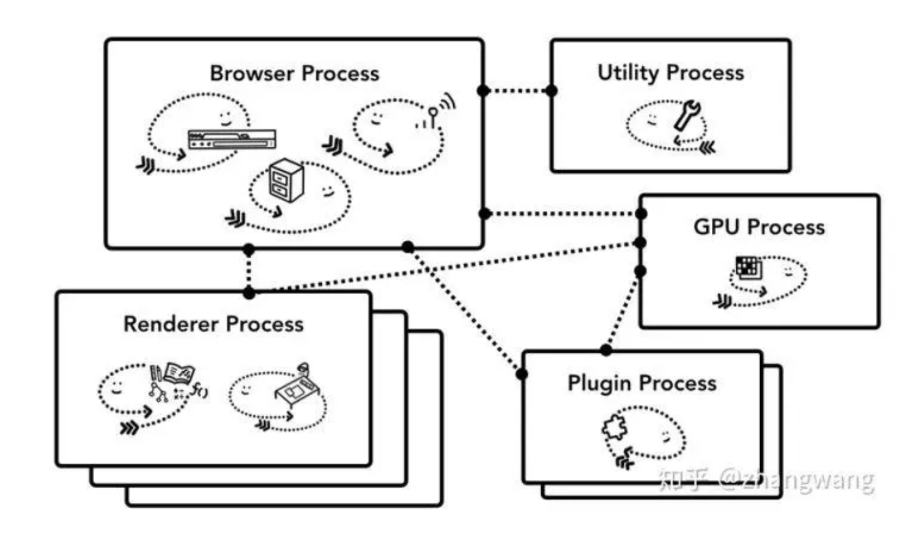
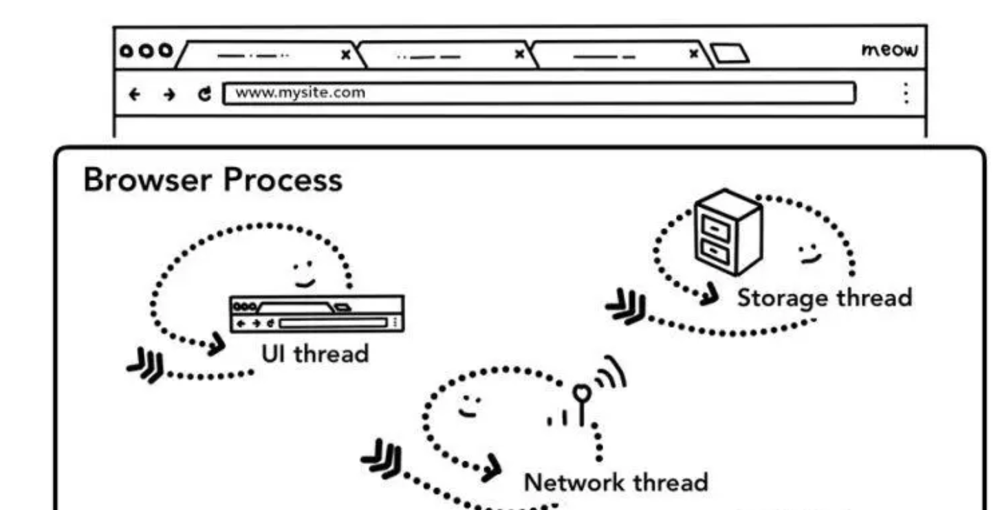

## 目录
- [浏览器的多进程架构](#浏览器的多进程架构)
- [导航](#导航)

### 浏览器的多进程架构

以 Chrome 为例，它由多个进程组成，每个进程都有自己核心的职责，它们相互配合完成浏览器的整体功能，每个进程中又包含多个线程，一个进程内的多个线程也会协同工作，配合完成所在进程的职责。Chrome 采用多进程架构，其顶层存在一个 Browser process 用以协调浏览器的其它进程。

**多进程**

- Browser Process
  - 负责包括地址栏，书签栏，前进后退按钮等部分的工作
  - 负责处理浏览器的一些不可见的底层操作，比如网络请求和文件访问
- Renderer Process
  - 负责一个 tab 内关于网页呈现的所有事情
- Plugin Process
  - 负责控制一个网页用到的所有插件，如 flash
- GPU Process
  - 负责处理 GPU 相关的任务
  
### 导航

***多线程***

浏览器 Tab 外的工作主要由 Browser Process 掌控，Browser Process 又对这些工作进一步划分，使用不同线程进行处理

- UI thread ： 控制浏览器上的按钮及输入框；
- network thread: 处理网络请求，从网上获取数据；
- storage thread: 控制文件等的访问；

当我们在浏览器地址栏中输入文字，并点击回车获得页面内容的过程在浏览器看来可以分为以下几步：
- 处理输入
  - UI thread 需要判断用户输入的是 URL 还是 query；
- 开始导航
  - 当用户点击回车键，UI thread 通知 network thread 获取网页内容，并控制 tab 上的 spinner 展现，表示正在加载中
  - network thread 会执行 DNS 查询，随后为请求建立 TLS 连接
- 读取响应
  - 当请求响应返回的时候，network thread 会依据 Content-Type 及 MIME Type sniffing 判断响应内容的格式
  - 如果响应内容的格式是 HTML ，下一步将会把这些数据传递给 renderer process，如果是 zip 文件或者其它文件，会把相关数据传输给下载管理器
  - Safe Browsing 检查也会在此时触发，如果域名或者请求内容匹配到已知的恶意站点，network thread 会展示一个警告页。此外 CORB 检测也会触发确保敏感数据不会被传递给渲染进程
- 查找渲染进程
  - 当上述所有检查完成，network thread 确信浏览器可以导航到请求网页，network thread 会通知 UI thread 数据已经准备好，UI thread 会查找到一个 renderer process 进行网页的渲染。
  
> 由于网络请求获取响应需要时间，这里其实还存在着一个加速方案。当 UI thread 发送 URL 请求给 network thread 时，浏览器其实已经知道了将要导航到那个站点。UI thread 会并行的预先查找和启动一个渲染进程，如果一切正常，当 network thread 接收到数据时，渲染进程已经准备就绪了，但是如果遇到重定向，准备好的渲染进程也许就不可用了，这时候就需要重启一个新的渲染进程。
- 确认导航
  - Browser Process 会给 renderer process 发送 IPC 消息来确认导航，一旦 Browser Process 收到 renderer process 的渲染确认消息，导航过程结束，页面加载过程开始。
  - 此时，地址栏会更新，展示出新页面的网页信息。history tab 会更新，可通过返回键返回导航来的页面，为了让关闭 tab 或者窗口后便于恢复，这些信息会存放在硬盘中。
  - 一旦导航被确认，renderer process 会使用相关的资源渲染页面，下文中我们将重点介绍渲染流程。当 renderer process 渲染结束（渲染结束意味着该页面内的所有的页面，包括所有 iframe 都触发了 onload 时），会发送 IPC 信号到 Browser process， UI thread 会停止展示 tab 中的 spinner

 

